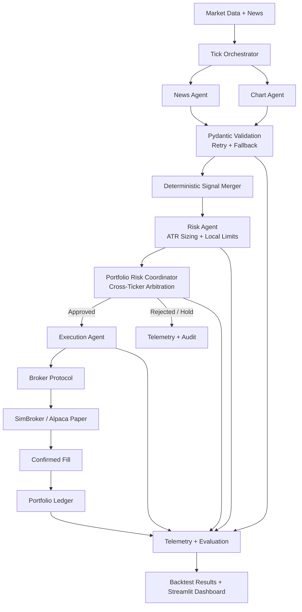

<div align="center">

# 📈 AI Multi-Agent Trading Firm

### Auditable Multi-Agent Trading Research & Backtesting Platform

**LangGraph agents interpret market evidence. Deterministic risk, portfolio, execution, and accounting systems authorize every action.**

[](https://www.python.org/)
[](https://github.com/langchain-ai/langgraph)
[](#-testing)
[](https://streamlit.io/)
[](LICENSE)

> ⚠️ **Paper trading and historical backtesting only. No real capital is at risk.**
🔗 **Live Demo:** [AI MULTI AGENT TRADING FIRM Streamlit App]
> (https://ai-multi-agent-trading-firm-ft7czhcn94s7flzhj96pk3.streamlit.app/)

</div>

---

## 📌 Overview

**AI Multi-Agent Trading Firm** is a reproducible trading research platform that combines LLM-based market interpretation with deterministic financial controls.

LLM agents analyze news and technical market data, but they do **not** directly place trades, set risk limits, or modify portfolio accounting. A deterministic control plane validates signals, authorizes risk, arbitrates portfolio-level constraints, executes approved orders, and maintains the ledger.

---

## Architecture



### System Layers

| Layer | Responsibility |
|---|---|
| Intelligence | News and Chart agents produce structured market judgments |
| Control | Output validation, signal fusion, risk authorization, and portfolio arbitration |
| Execution | Broker calls, confirmed fills, idempotency, and ledger updates |
| Observability | LangSmith traces, tick telemetry, audit events, and evaluation |

---

## Key Features

### Multi-Agent Orchestration

- LangGraph pipeline with parallel News and Chart agents
- Multi-ticker fan-out using isolated ticker-level subgraphs
- Deterministic signal merger for agent-output reconciliation
- Explicit hold and rejection paths for unauthorized proposals

### Deterministic Risk Controls

A bullish LLM signal does not automatically become an order.

| Control | Default |
|---|---:|
| Risk per trade | 1% of equity |
| Stop methodology | 1.5× ATR |
| Maximum position per ticker | 20% |
| Maximum sector exposure | 40% |
| Maximum concurrent positions | 3 |
| Daily circuit breaker | -3% |
| Correlation threshold | 0.7 |

The risk engine can approve, reject, or downsize proposals; enforce ticker, sector, and correlation limits; and halt trading after the daily circuit breaker.

### Safe LLM Integration

- LLM responses are treated as untrusted structured inputs
- Pydantic schemas validate every agent output
- Invalid outputs trigger retry and then a safe fallback
- Malformed output cannot reach the risk or execution layers

### Broker-Agnostic Execution

- Common broker protocol supports SimBroker for backtesting and Alpaca for paper trading
- Idempotent order handling prevents duplicate accounting
- Confirmed fills drive portfolio-state updates
- Ledger supports weighted-average cost, partial sells, realized P&L, cash, and open positions

### Lookahead-Safe Backtesting

- Historical sessions are replayed through the same core pipeline
- Each run uses fresh portfolio state and a simulated date
- Data access is restricted to information available at the current tick
- Results are benchmarked against equal-weight buy-and-hold

---

## Evaluation

Backtests generate an equity curve and compare strategy performance against buy-and-hold.

Metrics include:

- Total return
- Excess return vs benchmark
- Sharpe ratio
- Maximum drawdown
- Realized P&L
- Profit factor
- Win rate
- Closed round-trip trades

`win_rate = None` indicates that no closed trades were scored, not a 0% win rate.

Short backtests validate execution correctness, accounting, risk authorization, orchestration, and failure handling. They are not statistically significant evidence of future profitability.

---

## Observability

Every tick can be reconstructed across the full decision path:

```text
Market Data → Agent Signal → Signal Merge → Risk Decision →
Portfolio Arbitration → Execution → Fill → Ledger → Performance
```

Structured telemetry records agent signals, confidence, agreement, proposed quantity, risk decisions, portfolio decisions, execution outcomes, fills, news provenance, and portfolio state.

News availability is explicitly represented as `AVAILABLE`, `UNAVAILABLE`, `ERROR`, or `AVAILABLE_WITH_ZERO_ELIGIBLE_ARTICLES`. Missing news is not silently treated as a neutral signal.

---

## Reliability

| Failure Path | System Behavior |
|---|---|
| Invalid LLM output | Validate, retry, then safe fallback |
| Unsafe or rejected proposal | Reject; no execution or ledger mutation |
| Execution failure | No confirmed fill; no ledger mutation |
| Duplicate order | Idempotency check prevents duplicate accounting |
| Daily loss limit | Circuit breaker halts further trading |

Rejected, failed, and unconfirmed events never mutate portfolio accounting.

---

## Tech Stack

| Layer | Tools |
|---|---|
| Agent orchestration | LangGraph |
| LLM inference | Groq / GPT-OSS models |
| Structured validation | Pydantic |
| Guardrails | NeMo Guardrails |
| Market data | Alpaca, yfinance fallback |
| News | NewsAPI |
| Broker execution | SimBroker, Alpaca Paper |
| Portfolio accounting | Custom JSON-backed ledger |
| Observability | LangSmith, structured telemetry |
| Backtesting | Historical replay engine |
| Dashboard | Streamlit |
| Testing | pytest |
| CI | GitHub Actions |
| Runtime | Python 3.13, uv |

---

## Project Structure

```text
AI-Multi-Agent-Trading-Firm/
├── agents/                 # News, chart, risk, execution, signal merger, guardrails
├── graph/                  # LangGraph state, nodes, and graph builder
├── orchestrator/           # Multi-ticker tick runner
├── portfolio/              # Ledger, risk coordinator, correlation, circuit breaker
├── broker/                 # Broker protocol, SimBroker, Alpaca broker
├── data_sources/           # Live and historical data schemas
├── data_cache/             # Historical OHLCV and news cache
├── backtest/               # Runner, metrics, and result artifacts
├── mandates/               # Risk mandate configuration
├── config/                 # Settings, sectors, guardrails
├── dashboard/              # Streamlit dashboard components
├── harness/                # Experiment and evaluation utilities
├── telemetry/              # Structured observability
├── tests/                  # Automated test suite
├── ui.py                   # Streamlit entrypoint
└── requirements.txt
```

---

## Quick Start

### Install

```bash
pip install -r requirements.txt
```

Or with `uv`:

```bash
uv pip install -r requirements.txt
```

### Configure environment

Create a `.env` file:

```env
GROQ_API_KEY=your_groq_api_key
NEWSAPI_KEY=your_newsapi_key

ALPACA_API_KEY=your_alpaca_api_key
ALPACA_API_SECRET=your_alpaca_api_secret

TRADING_MODE=backtest

LANGCHAIN_TRACING_V2=true
LANGCHAIN_API_KEY=your_langsmith_api_key
LANGCHAIN_PROJECT=ai-multi-agent-trading-firm
```

Supported modes:

```text
backtest
paper
```

### Run a backtest

```bash
python -m backtest.runner \
  --tickers AAPL,MSFT,GOOGL,JPM \
  --start 2026-08-25 \
  --end 2026-09-20 \
  --run-id sep2026
```

Results are written to:

```text
backtest/results/sep2026.json
```

### Launch dashboard

```bash
streamlit run ui.py
```

### Run tests

```bash
pytest tests/ -v
```

---

## Testing

The project includes **168 automated tests** covering portfolio accounting, risk controls, guardrails, backtesting, orchestration, execution semantics, and failure scenarios.

CI runs the test suite through GitHub Actions.

---


---
