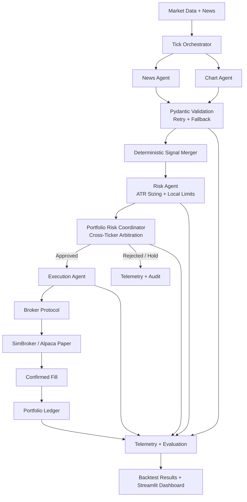

<div align="center">

# 📈 AI Multi-Agent Trading Firm

### Auditable Multi-Agent Trading Research & Backtesting Platform

**LangGraph agents interpret market evidence. Deterministic risk, portfolio, execution, and accounting systems authorize every action.**

[](https://www.python.org/)
[](https://github.com/langchain-ai/langgraph)
[](#-testing)
[](https://streamlit.io/)
[](LICENSE)

> ⚠️ **Paper trading and historical backtesting only. No real capital is at risk.**

</div>

---

## 📌 Overview

**AI Multi-Agent Trading Firm** is a reproducible trading research platform that combines LLM-based market interpretation with deterministic financial controls.

LLM agents analyze news and technical market data, but they do **not** directly place trades, set risk limits, or modify portfolio accounting. A deterministic control plane validates signals, authorizes risk, arbitrates portfolio-level constraints, executes approved orders, and maintains the ledger.

> **Core principle:** Let AI reason. Let deterministic systems enforce.

---

## 🧠 Architecture



### Design Boundary

```text
LLM judgment ≠ authorization to trade
```

| Plane | Responsibility |
|---|---|
| **Intelligence Plane** | News and Chart agents produce structured market judgments |
| **Control Plane** | Validation, signal fusion, risk authorization, and portfolio arbitration |
| **Execution Plane** | Broker calls, confirmed fills, idempotency, and ledger updates |
| **Observability Plane** | LangSmith traces, tick telemetry, audit events, and evaluation |

---

## ✨ Key Features

### 🤖 Multi-Agent Orchestration

- LangGraph-based multi-agent pipeline with parallel News and Chart agents.
- Multi-ticker fan-out using isolated ticker-level subgraphs.
- Deterministic Signal Merger reconciles agent outputs without relying on another LLM.
- Explicit `HOLD` and rejection paths for unsafe or unauthorized proposals.

### 🛡️ Deterministic Risk Controls

A bullish LLM signal does not automatically become an order.

| Control | Default |
|---|---:|
| Risk per trade | 1% of equity |
| Stop methodology | 1.5× ATR |
| Maximum position per ticker | 20% |
| Maximum sector exposure | 40% |
| Maximum concurrent positions | 3 |
| Daily circuit breaker | -3% |
| Correlation threshold | 0.7 |

The risk engine can approve, reject, downsize, enforce exposure limits, reject excessive correlation, and halt trading after the daily circuit breaker.

### 🧠 Safe LLM Integration

- LLM responses are treated as untrusted structured inputs.
- Pydantic schemas validate every agent output.
- Invalid outputs trigger retry and then a safe fallback.
- Malformed model output cannot silently reach risk or execution layers.

### 🏦 Broker-Agnostic Execution

- Common broker protocol supports `SimBroker` for backtesting and Alpaca for paper trading.
- Idempotent order handling prevents duplicate accounting.
- Confirmed fills drive portfolio state updates.
- Ledger supports weighted-average cost, partial sells, realized P&L, cash, and open positions.

### 🔁 Lookahead-Safe Backtesting

- Historical sessions are replayed through the same core pipeline.
- Each run uses fresh portfolio state and a simulated date.
- Data access is restricted to information available at the current tick.
- Results are benchmarked against equal-weight buy-and-hold.

```text
T-2 ─── T-1 ─── T ─── T+1 ─── T+2
                 ↑
Allowed: T-2, T-1, T
Forbidden: T+1, T+2
```

---

## 📊 Evaluation

Backtests generate an equity curve and compare strategy performance against buy-and-hold.

Metrics include:

- Total return
- Excess return vs benchmark
- Sharpe ratio
- Maximum drawdown
- Realized P&L
- Profit factor
- Win rate
- Closed round-trip trades

> `win_rate = None` means there were no scored closed trades—not a 0% win rate.

Short backtests validate execution correctness, accounting, risk authorization, orchestration, and failure handling. They are not statistically significant evidence of future profitability.

---

## 🔍 Observability

Every tick can be reconstructed across the full decision path:

```text
Market Data → Agent Signal → Signal Merge → Risk Decision →
Portfolio Arbitration → Execution → Fill → Ledger → Performance
```

Structured telemetry records:

- Agent signal and confidence
- Agent agreement
- ATR, entry price, and proposed quantity
- Risk decision and notes
- Portfolio-level approval or rejection
- Execution attempt and result
- Confirmed fill
- News provenance
- Portfolio state

News availability is explicit: `AVAILABLE`, `UNAVAILABLE`, `ERROR`, or `AVAILABLE_WITH_ZERO_ELIGIBLE_ARTICLES`. Missing news is never silently converted into a neutral signal.

---

## 🧪 Reliability

| Failure Path | System Behavior |
|---|---|
| Invalid LLM output | Validate → retry → safe fallback |
| Unsafe or rejected proposal | Reject → no execution → no ledger mutation |
| Execution failure | No confirmed fill → no ledger mutation |
| Duplicate order | Idempotency check prevents duplicate accounting |
| Daily loss limit | Circuit breaker halts further trading |

These invariants ensure rejected, failed, or unconfirmed events never mutate portfolio accounting.

---

## 🧩 Tech Stack

| Layer | Tools |
|---|---|
| Agent orchestration | LangGraph |
| LLM inference | Groq / GPT-OSS models |
| Structured validation | Pydantic |
| Guardrails | NeMo Guardrails |
| Market data | Alpaca, yfinance fallback |
| News | NewsAPI |
| Broker execution | SimBroker, Alpaca Paper |
| Portfolio accounting | Custom JSON-backed ledger |
| Observability | LangSmith, structured tick telemetry |
| Backtesting | Historical replay engine |
| Dashboard | Streamlit |
| Testing | pytest |
| CI | GitHub Actions |
| Runtime | Python 3.13, uv |

---

## 📂 Project Structure

```text
AI-Multi-Agent-Trading-Firm/
├── agents/                 # News, chart, risk, execution, signal merger, guardrails
├── graph/                  # LangGraph state, nodes, and graph builder
├── orchestrator/           # Multi-ticker tick runner
├── portfolio/              # Ledger, risk coordinator, correlation, circuit breaker
├── broker/                 # Broker protocol, SimBroker, Alpaca broker
├── data_sources/           # Live and historical data schemas
├── data_cache/             # Historical OHLCV and news cache
├── backtest/               # Runner, metrics, and result artifacts
├── mandates/               # Risk mandate configuration
├── config/                 # Settings, sectors, guardrails
├── dashboard/              # Streamlit dashboard components
├── harness/                # Experiment and evaluation utilities
├── telemetry/              # Structured observability
├── tests/                  # Automated test suite
├── ui.py                   # Streamlit entrypoint
└── requirements.txt
```

---

## 🚀 Quick Start

### 1. Install

```bash
pip install -r requirements.txt
```

Or with `uv`:

```bash
uv pip install -r requirements.txt
```

### 2. Configure environment

Create a `.env` file:

```env
GROQ_API_KEY=your_groq_api_key
NEWSAPI_KEY=your_newsapi_key

ALPACA_API_KEY=your_alpaca_api_key
ALPACA_API_SECRET=your_alpaca_api_secret

TRADING_MODE=backtest

LANGCHAIN_TRACING_V2=true
LANGCHAIN_API_KEY=your_langsmith_api_key
LANGCHAIN_PROJECT=ai-multi-agent-trading-firm
```

Supported modes:

```text
backtest
paper
```

### 3. Run a backtest

```bash
python -m backtest.runner \
  --tickers AAPL,MSFT,GOOGL,JPM \
  --start 2026-08-25 \
  --end 2026-09-20 \
  --run-id sep2026
```

Results are written to:

```text
backtest/results/sep2026.json
```

### 4. Launch the dashboard

```bash
streamlit run ui.py
```

### 5. Run tests

```bash
pytest tests/ -v
```

---

## 🖥️ Dashboard

The Streamlit research dashboard supports:

- Backtest execution
- Agent pipeline stages
- Risk approvals and rejections
- Execution events
- Portfolio state
- Equity curves
- Trade analysis
- Performance metrics
- Structured telemetry

---

## 🧪 Testing

The project includes **168 automated tests** covering:

- Portfolio accounting
- Risk controls
- Guardrails
- Backtesting
- Orchestration
- Execution semantics
- Failure scenarios

CI runs the test suite through GitHub Actions.

---

## 🔬 Research Roadmap

Future work focuses on evaluation quality rather than adding more agents:

- News-only vs Chart-only ablations
- News + Chart vs deterministic baseline
- Walk-forward and out-of-sample validation
- Multiple market-regime evaluation
- Transaction-cost and slippage modeling
- LLM latency and cost analysis
- Strategy attribution
- Statistical significance testing

The central research question:

> Does the AI component actually improve trading decisions, and under what market conditions?

---

## 🔐 Disclaimer

This project is for educational, research, backtesting, and paper-trading purposes only.

It does not provide financial advice and is not intended to manage real capital. Risk controls are software safeguards, not guarantees against financial loss. Past backtest performance does not guarantee future results.

---

## 👤 Author

**Raj Rajput**  
Aspiring AI/ML Engineer · Agentic AI · LLM Systems · Production ML

- GitHub: [@rj1230](https://github.com/rj1230)
